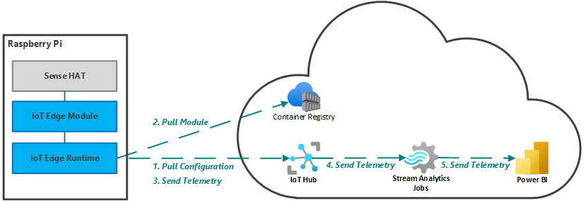
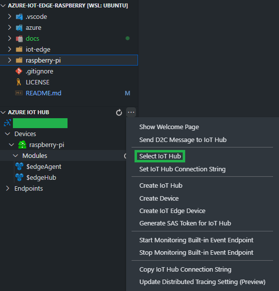
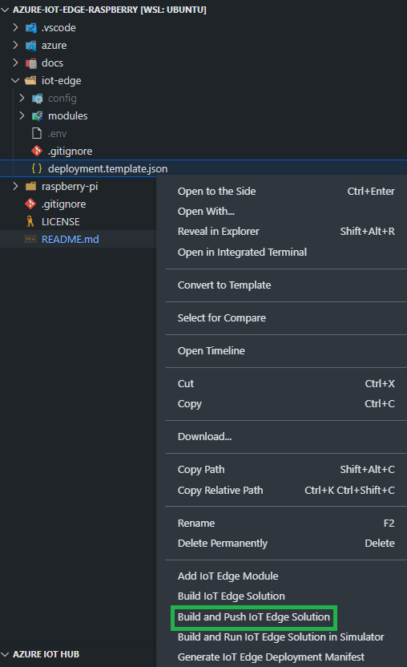
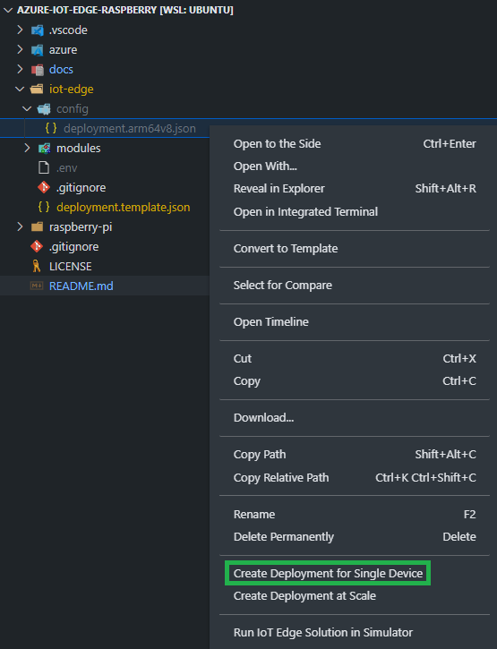
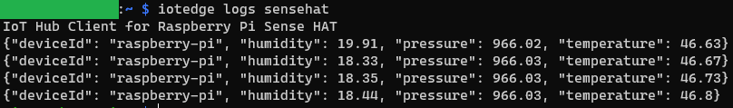
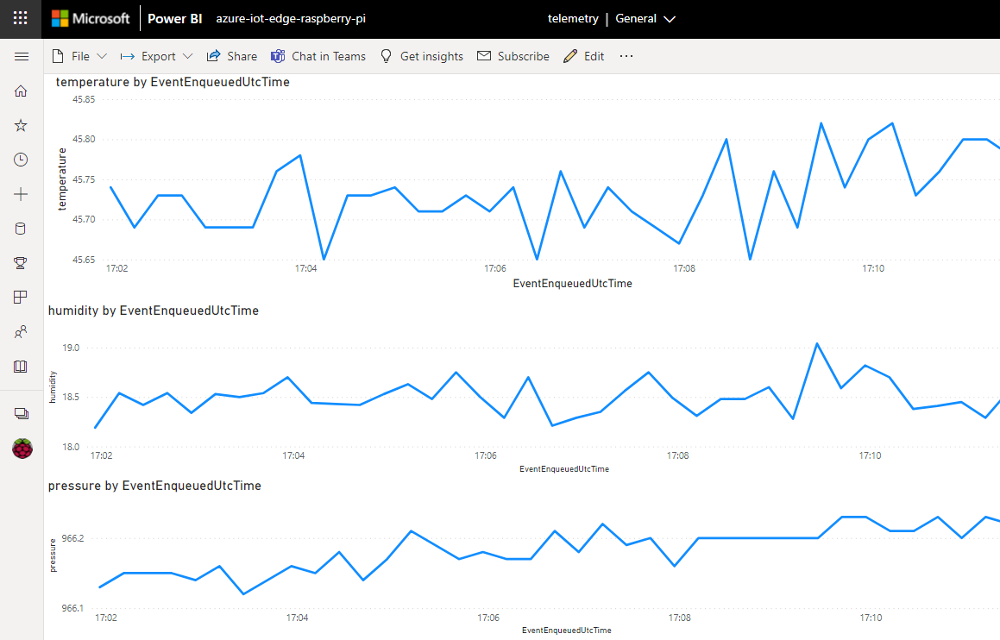

# Azure IoT Edge on Raspberry Pi

## Overview

Sample outlining how Azure IoT Edge can be deployed, run and managed on a [Raspberry Pi 4B](https://www.raspberrypi.com/products/raspberry-pi-4-model-b/) with [Sense HAT](https://www.raspberrypi.com/products/sense-hat/):



- **Raspberry Pi** - Raspberry Pi configured as an IoT Edge Device, which is deployed at an edge site (e.g.,  home or factory building).
    - **Sense HAT** - Sense HAT is an add-on board for Raspberry Pi which we will use to collect telemetry i.e., temperature, humidity and pressure. Alternatively, the [Sense HAT emulator](https://projects.raspberrypi.org/en/projects/getting-started-with-the-sense-hat/2) can be used.
    - **IoT Edge Module** - Containerized custom code which reads telemetry from Sense HAT and sends it via the IoT Edge Runtime to IoT Hub.
    - **IoT Edge Runtime** - The IoT Edge Runtime is a collection of components that turn a device into an IoT Edge Device. Collectively, the components enable IoT Edge Devices to receive code to run at the edge and communicate the results.
- **Cloud** - We will use Azure to manage our IoT Edge Devices and Modules. Also, we will feed a Power BI report via Stream Analytics Jobs to visualize the telemetry in real-time.
    - **Container Registry** - IoT Edge Modules are stored in the Container Registry. The modules can be custom code or installed from the IoT Edge Module Marketplace.
    - **IoT Hub** - IoT Hub enable highly secure and reliable communication between your IoT application and the devices it manages. Azure IoT Hub provides a cloud-hosted solution back end to connect virtually any device. Extend your solution from the cloud to the edge with per-device authentication, built-in device management, and scaled provisioning.
    - **Stream Analytics Jobs** - The Stream Analytics Job runs real-time analytic computations on the telemetry from your devices.
    - **Power BI** - Power BI will be used to visualize the telemetry coming from your device.

## Prerequisities

### Development Machine

1. Open bash on your development machine e.g., by using [Windows Subsystem for Linux](https://docs.microsoft.com/en-us/windows/wsl/).

2. Verify whether Docker is installed, if not follow this [guide](https://docs.docker.com/get-docker/) for installation:

```bash
docker version # Version should be '20.10.12' or newer.
```

3. Verify whether SSH is installed:

```bash
ssh -V
```

4. Verify whether Azure CLI is installed, if not follow this [guide](https://docs.microsoft.com/en-us/cli/azure/install-azure-cli) for installation:

```bash
az version # Version should be '2.33.0' or newer.
```

5. Verify whether Git is installed, if not follow this [guide](https://git-scm.com/book/en/v2/Getting-Started-Installing-Git) for installation:

```bash
git version # Version should be '2.25.1' or newer.
```

6. Clone the GitHub repository by using the VSCode terminal:

```bash
git clone https://github.com/fawohlsc/azure-iot-edge-raspberry-pi.git
```

7. Verify whether Visual Studio Code (VSCode) is installed, if not follow this [guide](https://code.visualstudio.com/docs/setup/linux) for installation:

```bash
code -v
```

8. Install the VSCode extension [Azure IoT Tools](https://marketplace.visualstudio.com/items?itemName=vsciot-vscode.azure-iot-tools):

```
code --install-extension "vsciot-vscode.azure-iot-tools" --force
```

9. Open the repository in VSCode:

```bash
code ./azure-iot-edge-raspberry-pi
```

### Raspberry Pi

1. Setup your Raspberry Pi 4B following this [guide](https://projects.raspberrypi.org/en/projects/raspberry-pi-setting-up/0). This sample targets [Raspberry Pi OS Bullseye](https://www.raspberrypi.com/software/) in 64-bit, which itself is based on Debian GNU/Linux 11 (bullseye) . Verify the version of Raspberry Pi OS:

```bash
cat /etc/os-release # Pretty name should be 'Debian GNU/Linux 11 (bullseye)'.
```

2. Setup Sense HAT on your Raspberry Pi following this [guide](https://projects.raspberrypi.org/en/projects/getting-started-with-the-sense-hat/0).

3. Enable SSH on your Raspberry Pi:

```bash
sudo raspi-config # Navigate to 'Interfacing Options', 'SSH', and confirm with 'Yes'
```

4. Determine the IP Address of the Raspberry Pi:

```bash
ifconfig
```

5. Open bash on your development machine to login to the Raspberry Pi using SSH:

```bash
raspberry_pi_user="<REPLACE_RASPBERRY_USER_NAME>" # e.g., pi
raspberry_pi_ip_address="<REPLACE_RASPBERRY_PI_IP_ADDRESS>" # e.g., 192.168.0.123

ssh "${raspberry_pi_user}@${raspberry_pi_ip_address}"
```

6. Close the SSH connection to Raspberry Pi:

```bash
exit
```

## Setup

### Azure

1. Open a terminal with bash in VSCode.

2. Login to Azure:

```bash
az login
```

3. Deploy to Azure:

```bash
chmod u+x ./azure/deploy.sh; ./azure/deploy.sh
```

4. In VSCode, select your newly created IoT Hub:



### Raspberry Pi

1. Determine the IoT Hub name:

```bash
resource_group_name="azure-iot-edge-raspberry-pi"
iot_hub_name=$(az iot hub list --resource-group $resource_group_name --query "[0].name" --output tsv)
```

2. Determine the IoT Edge Device connection string:

```bash
iot_edge_device_id="raspberry-pi"
iot_edge_device_connection_string=$(az iot hub device-identity connection-string show --hub-name $iot_hub_name --device-id $iot_edge_device_id --output tsv)
```

3. Setup IoT Edge on the Raspberry Pi:

```bash
raspberry_pi_user="<REPLACE_RASPBERRY_USER_NAME>" # e.g., pi
raspberry_pi_ip_address="<REPLACE_RASPBERRY_PI_IP_ADDRESS>" # e.g., 192.168.0.123

ssh "${raspberry_pi_user}@${raspberry_pi_ip_address}" "bash -s '${iot_edge_device_connection_string}'" < ./raspberry-pi/setup.sh
```

4. Wait a few minutes until the connection between the IoT Edge Device and IoT Hub is established (```ConnectionState: Connected```):

```bash
az iot hub device-identity list --hub-name $iot_hub_name --query "[].{DeviceId:deviceId,ConnectionState:connectionState}" --output table
```

> See this [guide](https://docs.microsoft.com/en-us/azure/iot-edge/troubleshoot?view=iotedge-2020-11) for troubleshooting connectivity issues.

### IoT Edge

1. In your already opened terminal, determine the Container Registry name:

```bash
acr_name=$(az acr list --resource-group $resource_group_name --query "[0].name" --output tsv)
```

2. Login to the Container Registry:

```bash
az acr login --name $acr_name
```

3. In VSCode, right click on [./iot-edge/deployment.template.json](./iot-edge/deployment.template.json) to select 'Build and Push IoT Edge Solution'.



> Since the IoT Edge Module requires access Sense HAT, it runs as priviledged container (See: [./iot-edge/deployment.template.json](./iot-edge/deployment.template.json)):

```json
...
"modules": {
    "sensehat": {
        "version": "1.0",
        "type": "docker",
        "status": "running",
        "restartPolicy": "always",
        "settings": {
            "image": "${MODULES.sensehat}",
            "createOptions": {
                "HostConfig": {
                    "Privileged": true
                }
            }
        }
    }
}
...
```

4. Since a new tab 'Azure IoT Edge' in the terminal will be opened, switch to the previously used terminal tab 'bash'.

5. Wait for the previous operation to complete and verify the IoT Edge Module having been pushed to the Container Registry:

```bash
acr_repository_name="sensehat"
az acr repository show-tags --name $acr_name --repository $acr_repository_name -o tsv # Output should be '1.0.0-arm64v8'.
```

> Do not forget to increment the version in the [module.json](./iot-edge/modules/sensehat/module.json) when you update the IoT Edge Module. Otherwise IoT Edge Runtime will not update the IoT Edge Module on the IoT Edge Device during deployment (See: [GitHub Issue](https://github.com/Azure/iotedge/issues/364)).

6. In VSCode, right click on [./iot-edge/deployment.template.json](./iot-edge/config/deployment.arm64v8.json) to select 'Create Deployment for Single Device' and your IoT Edge Device:



7. After the deployment, login to the Raspberry Pi using SSH:

```bash
ssh "${raspberry_pi_user}@${raspberry_pi_ip_address}"
```

8. List the IoT Edge Modules:

```bash
iotedge list
```

9. View the logs of the IoT Edge Runtime:

```bash
iotedge logs edgeAgent

iotedge logs edgeHub
```

10. The logs of our custom IoT Edge Module should contain telemetry readings:

```bash
iotedge logs sensehat
```



11. Close the SSH connection to Raspberry Pi:

```bash
exit
```

11. Monitor the telemetry arriving at the IoT Hub:

```bash
az iot hub monitor-events --hub-name $iot_hub_name
```

12. Exit monitoring by pressing ```Ctrl + C```.

### Power BI

1. Follow this [guide](https://docs.microsoft.com/en-us/azure/iot-hub/iot-hub-live-data-visualization-in-power-bi) to expose the real-time telemetry as Power BI Report:


2. Create line diagrams to visualize temperature, humidity and pressure over time:



3. Congratulations! You have completed the setup. Your feedback and contributions are very much appreciated i.e., starring this repository, raising issues or opening pull requests. Many thanks upfront!

## Clean-up

### Raspberry Pi

1. Login to the Raspberry Pi using SSH:

```bash
ssh "${raspberry_pi_user}@${raspberry_pi_ip_address}"
```

2. Delete the IoT Edge Runtime:

```bash
sudo apt-get purge aziot-edge --yes
sudo apt-get purge aziot-identity-service --yes
```

3. Remove all running container:
```bash
sudo docker rm -f $(sudo docker ps --all --quiet) >/dev/null 2>&1 || true
```

4. Delete all unused container images:

```bash
sudo docker image prune --all --force
```

5. Delete the Moby Engine:

```bash
sudo apt-get purge moby-engine --yes
```

6. Close the SSH connection to Raspberry Pi:

```bash
exit
```

### Azure

1. Delete the resource group:

```bash
az group delete --name $resource_group_name --yes --no-wait
```

### Power BI

1. Delete the previously created Power BI Report.

## Going further

1. [Debugging of IoT Edge Modules](https://docs.microsoft.com/en-us/azure/iot-edge/how-to-vs-code-develop-module?view=iotedge-2020-11)
2. [Deploy IoT Edge Modules at scale](https://docs.microsoft.com/en-us/azure/iot-edge/how-to-deploy-cli-at-scale?view=iotedge-2020-11)
3. [Remote monitoring for IoT Edge Devices](https://docs.microsoft.com/en-us/azure/iot-hub/tutorial-use-metrics-and-diags)
4. Storing data on IoT Edge Devices using [SQL Edge](https://docs.microsoft.com/en-us/azure/azure-sql-edge/overview?toc=%2Fazure%2Fiot-edge%2Ftoc.json&bc=%2Fazure%2Fiot-edge%2Fbreadcrumb%2Ftoc.json&view=iotedge-2020-11) and [Blob Storage](https://docs.microsoft.com/en-us/azure/iot-edge/how-to-store-data-blob?view=iotedge-2020-11)
5. [Analyzing data on IoT Edge Devices](https://docs.microsoft.com/en-us/azure/stream-analytics/stream-analytics-edge)
6. [Running machine learning on IoT Edge Devices](https://docs.microsoft.com/en-us/azure/iot-edge/tutorial-machine-learning-edge-01-intro?view=iotedge-2020-11)
7. [Leveraging IoT Edge as a gateway to connect IoT devices with IoT Hub](https://docs.microsoft.com/en-us/azure/iot-edge/iot-edge-as-gateway?view=iotedge-2020-11)
8. [Reacting to IoT Hub events by using Event Grid to trigger actions](https://docs.microsoft.com/en-us/azure/iot-hub/iot-hub-event-grid)
